# Centralized Identity & Authorization Provider

## Identitas

- Nama: Bryan Pratama Putra Hendra
- NIM: 13524067

## Ringkasan

Proyek ini adalah monorepo yang berisi Auth Provider, Control Panel Admin, dua relying application, dan Sync Worker. Auth Provider menjadi pusat autentikasi, central session, authorization policy, authorization code, access token, userinfo, dan revocation event.

## Komponen

| Komponen | Port | Tanggung jawab |
| --- | ---: | --- |
| Auth Provider Server | 3000 | Login, MFA/TOTP, central session, OAuth authorization code flow, token, userinfo, SSO logout, metrics, health probe |
| Control Panel Admin | 3004 | HTTP Basic Auth dan pengelolaan user, group, application, redirect URI, policy, audit log |
| App A | 3001 | Relying application pertama dengan local session dan profile cache sendiri |
| App B | 3002 | Relying application kedua dengan local session dan profile cache sendiri |
| Sync Worker | 3003 | Outbox publisher, RabbitMQ consumer, retry, DLQ, idempotent back-channel logout |
| PostgreSQL | 55432 (host) | Database Auth Provider, App A, dan App B |
| RabbitMQ Management | 15672 | Monitoring queue dan DLQ |

Database PostgreSQL yang digunakan:

- `identity_provider` untuk Auth Provider, Control Panel, session, token, audit, event, dan delivery.
- `app_a` untuk local session, profile cache, activity log, dan processed event App A.
- `app_b` untuk local session, profile cache, activity log, dan processed event App B.

## Teknologi

- Node.js 22
- TypeScript 5.7
- Fastify 5.2
- Prisma 7.9
- PostgreSQL 17
- RabbitMQ 4
- `amqplib` untuk koneksi RabbitMQ

## Konfigurasi

Salin template environment:

```bash
cp .env.example .env
```

Isi nilai berikut dengan secret lokal:

- `POSTGRES_PASSWORD`
- `AUTH_DATABASE_URL`, `APP_A_DATABASE_URL`, `APP_B_DATABASE_URL`
- `AUTH_DATABASE_URL_DOCKER`, `APP_A_DATABASE_URL_DOCKER`, `APP_B_DATABASE_URL_DOCKER`
- `INTERNAL_LOGOUT_TOKEN`
- `APP_CLIENT_SECRET`
- `SEED_USER_PASSWORD`
- `MFA_SECRET_ENCRYPTION_KEY`
- `ADMIN_USERNAME`
- `ADMIN_PASSWORD`

Compose memakai connection string `*_DOCKER` karena service saling mengakses melalui hostname Docker `postgres` dan `rabbitmq`. Test integration dari host memakai connection string host pada `.env` dan port PostgreSQL `55432`.

## Menjalankan Sistem

Install dependency:

```bash
npm install
```

Jalankan seluruh stack di foreground:

```bash
docker compose up --build
```

Atau jalankan di background:

```bash
docker compose up --build -d
```

Urutan setup database di Compose:

1. PostgreSQL dan RabbitMQ dinyalakan dan menunggu health check.
2. `db-init` membuat database `app_a` dan `app_b` jika belum ada.
3. `db-setup` menjalankan Prisma migration Auth Provider.
4. `db-setup` menyiapkan schema lokal App A dan App B.
5. Seed Auth Provider membuat demo user, group, application, redirect URI, dan policy.
6. Service aplikasi dan worker dijalankan.

Cek status service:

```bash
docker compose ps
```

URL utama:

- Auth Provider: `http://localhost:3000`
- App A: `http://localhost:3001`
- App B: `http://localhost:3002`
- Control Panel: `http://localhost:3004`
- Sync Worker health: `http://localhost:3003/health`
- RabbitMQ Management: `http://localhost:15672`

Seed user:

- `app-a-user@example.com`
- `app-b-user@example.com`
- `both-apps-user@example.com`
- `inactive-user@example.com`

Password seluruh demo user berasal dari `SEED_USER_PASSWORD`.

Untuk reset database lokal dan seed ulang dari awal:

```bash
docker compose down -v
docker compose up --build
```

## Arsitektur dan Alur

### Login App A/App B

1. User membuka App A atau App B.
2. Aplikasi membuat `state`, `code_verifier`, dan PKCE `code_challenge` S256.
3. Aplikasi mengarahkan browser ke Auth Provider `/authorize`.
4. Auth Provider memvalidasi `client_id`, application status, exact redirect URI, central session, user status, dan group policy.
5. Jika belum ada central session, Auth Provider mengarahkan user ke `/login` lalu melanjutkan request authorization awal.
6. Auth Provider menerbitkan authorization code sekali pakai dengan TTL pendek.
7. Aplikasi menukar code ke `/token` melalui back channel dengan client secret dan PKCE verifier.
8. Aplikasi memanggil `/userinfo` melalui back channel.
9. Aplikasi menyimpan profile cache dan local session token dalam bentuk hash.
10. Aplikasi menampilkan profil, session, activity log, dan processed events.

### Central Session dan Token

- Central session disimpan di tabel `sso_sessions`.
- Cookie central session bernama `central_session` dan memakai `HttpOnly`, `SameSite=Lax`, `Path=/`, serta `Max-Age`.
- Nilai session token, authorization code, dan access token tidak disimpan plaintext.
- Access token bersifat opaque dan disimpan sebagai SHA-256 hash.
- Access token terikat pada user, application, dan central session.
- `/userinfo` memvalidasi token, expiry, revocation, user status, application status, audience, dan central session.

### SSO Logout dan Revocation

Logout SSO, password change, user inactive, dan kehilangan akses akibat policy menghasilkan revocation event dalam transactional outbox:

1. Central session dan access token yang relevan dicabut secara sinkron.
2. Event disimpan di tabel `events`.
3. Delivery per application disimpan di `event_deliveries`.
4. Sync Worker mempublikasikan delivery ke RabbitMQ menggunakan persistent message dan confirm channel.
5. Worker memanggil `POST /internal/logout` pada application target.
6. Application mencabut local session dan mencatat event pada `processed_events`.
7. Event duplikat dijawab sukses tanpa melakukan revocation kedua kali.

Event gagal sementara masuk status retrying dengan exponential backoff. Setelah jumlah attempt maksimum tercapai, delivery berstatus `failed` dan message dikirim ke Dead-Letter Queue.

### Policy Access

Policy allow diberikan berdasarkan group user dan application. Jika user kehilangan akses terakhir ke App A, event `AccessPolicyChanged` ditargetkan ke App A. App B tidak menerima event tersebut jika policy App B masih mengizinkan akses.

### MFA/TOTP

MFA menggunakan TOTP 6 digit yang kompatibel dengan authenticator application:

1. User login dengan password dan central session aktif.
2. User membuka `/mfa/enroll`.
3. UI menampilkan manual secret dan `otpauth://` URI.
4. Secret disimpan terenkripsi AES-256-GCM menggunakan `MFA_SECRET_ENCRYPTION_KEY`.
5. User memverifikasi kode TOTP untuk mengaktifkan MFA.
6. Login berikutnya dengan password hanya membuat pending MFA challenge berumur 5 menit.
7. Central session baru dibuat setelah `/login/mfa` menerima kode valid.

## Keamanan

- Password user dan client secret di-hash menggunakan scrypt dengan salt acak.
- Session token, authorization code, access token, challenge token, dan local session token disimpan sebagai hash SHA-256.
- Secret TOTP disimpan terenkripsi AES-256-GCM, bukan plaintext database.
- App A dan App B tidak memiliki tabel password, password hash, authorization code, atau access token.
- Internal logout membutuhkan `x-internal-token` dari environment.
- Control Panel membutuhkan HTTP Basic Auth.
- Redirect URI harus exact match dan error OAuth hanya diarahkan ke URI yang telah tervalidasi.
- Error JSON memakai format aman berikut dan tidak mengembalikan stack trace atau secret:

```json
{
  "error": {
    "code": "ERROR_CODE",
    "message": "Pesan aman untuk user",
    "requestId": "request-id"
  }
}
```

## Endpoint Utama

### Auth Provider Server

- `GET /`
- `GET /login`
- `POST /login`
- `POST /login/mfa`
- `GET /password`
- `POST /password`
- `GET /mfa/enroll`
- `POST /mfa/enroll`
- `GET /session`
- `POST /logout-sso`
- `GET /authorize`
- `POST /token`
- `GET /userinfo`
- `GET /metrics`
- `GET /metrics/dashboard`
- `GET /health`
- `GET /health/live`
- `GET /health/ready`

Endpoint internal Auth Provider:

- `GET /internal/sessions/:id` dengan `x-internal-token` dan optional `x-client-id`.

### Control Panel Admin

Endpoint admin berikut membutuhkan Basic Auth. Endpoint health bersifat public agar dapat dipakai oleh probe:

- `GET /`
- `GET /health`, `GET /health/live`, `GET /health/ready` (public)
- `GET /admin/summary`
- `GET /admin/users`
- `POST /admin/users`
- `PATCH /admin/users/:id`
- `POST /admin/users/:id/password`
- `GET /admin/groups`
- `POST /admin/groups`
- `PATCH /admin/groups/:id`
- `DELETE /admin/groups/:id`
- `POST /admin/groups/:id/users`
- `DELETE /admin/groups/:id/users/:userId`
- `GET /admin/applications`
- `POST /admin/applications`
- `PATCH /admin/applications/:id`
- `DELETE /admin/applications/:id`
- `POST /admin/applications/:id/redirect-uris`
- `PATCH /admin/applications/:id/redirect-uris/:redirectUriId`
- `DELETE /admin/applications/:id/redirect-uris/:redirectUriId`
- `POST /admin/applications/:id/policies`
- `DELETE /admin/applications/:id/policies/:policyId`
- `GET /admin/audit-logs`
- `GET /admin/events`
- `GET /admin/event-deliveries`

### App A dan App B

Masing-masing application menyediakan route yang sama pada portnya sendiri:

- `GET /`
- `GET /login`
- `GET /callback`
- `POST /logout`
- `POST /internal/logout` dengan `x-internal-token`
- `GET /activity-logs`
- `GET /processed-events`
- `GET /health`
- `GET /health/live`
- `GET /health/ready`

## Observability dan Operations

Auth Provider `/metrics` menyediakan metric Prometheus untuk:

- Total request per route dan status.
- Total error HTTP `4xx` dan `5xx`.
- Total dan maksimum durasi request.
- Delivery pending, processing, retrying, failed, dan succeeded.
- Event delivery backlog.

Dashboard `/metrics/dashboard` menampilkan request, error, average latency, route metrics, dan event delivery metrics.

Semua service menyediakan `/health`, `/health/live`, dan `/health/ready`. Readiness mengecek database. Sync Worker juga mengecek koneksi RabbitMQ. Detail error dependency disanitasi menjadi `Dependency unavailable`.

Service menangani `SIGINT` dan `SIGTERM`. Listener ditutup, worker menghentikan consumer baru, delivery in-flight ditunggu, koneksi RabbitMQ dan database ditutup, lalu process keluar dengan status bersih.

## Testing

Build TypeScript:

```bash
npm run build
```

Validasi Prisma schema:

```bash
npm run db:validate
```

Unit test:

```bash
npm test
```

Integration test membutuhkan Docker Compose yang sudah hidup:

```bash
docker compose up --build -d
npm run test:integration
```

Integration suite mencakup OAuth/PKCE App A dan App B, local logout, SSO logout, password change, user inactive, access policy, MFA/TOTP, error security, metrics, worker retry, DLQ, idempotency, stale processing recovery, worker shutdown, dan in-flight delivery shutdown. Worker reconnect dan dependency failure behavior diverifikasi melalui pengujian operasional B03.

## Bonus yang Diimplementasikan

- B01 MFA/TOTP dengan enrollment UI, encrypted secret, pending challenge, dan audit log.
- B02 Observability dengan Prometheus-style metrics dan dashboard.
- B03 Liveness/readiness probe untuk seluruh service dan dependency failure behavior.
- B04 Graceful shutdown untuk SIGINT/SIGTERM, termasuk in-flight delivery worker.

Recovery code MFA tidak diimplementasikan karena bersifat opsional.

## Screenshots

### 1. Auth Provider Login

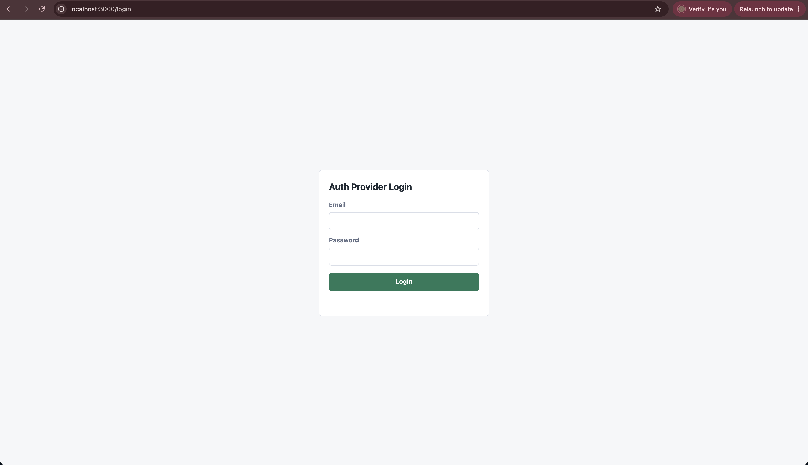

Form login Auth Provider.

### 2. Auth Provider Session

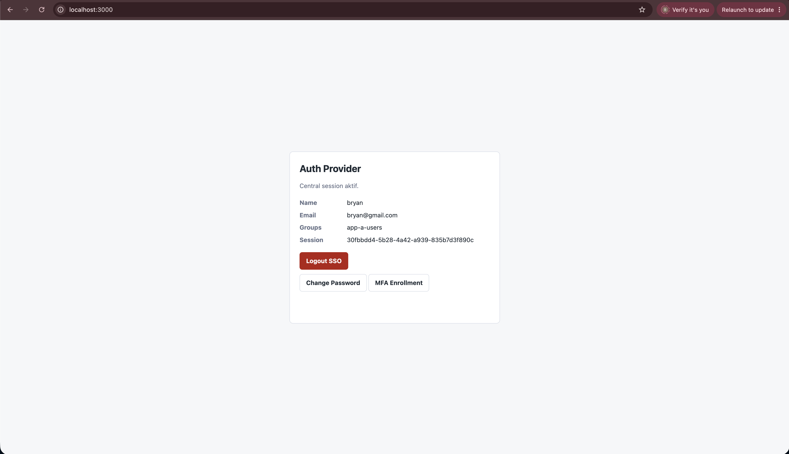

Central session aktif dan tombol Logout SSO.

### 3. MFA Enrollment

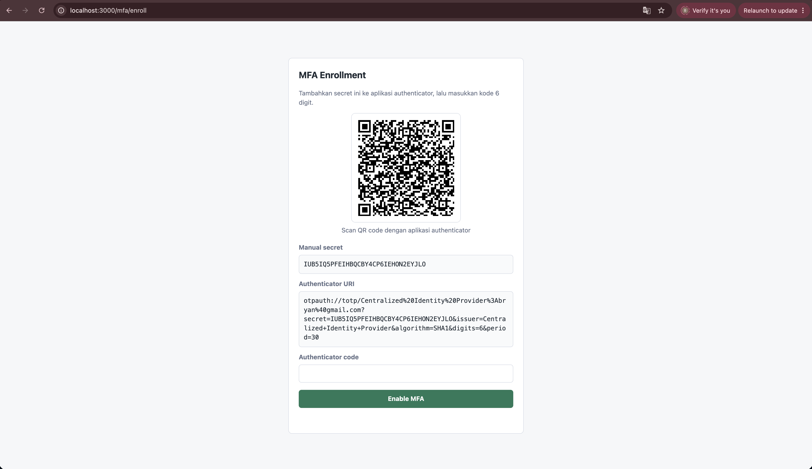

Halaman enrollment MFA dengan QR code, manual secret, dan authenticator URI.

### 4. MFA Login Challenge

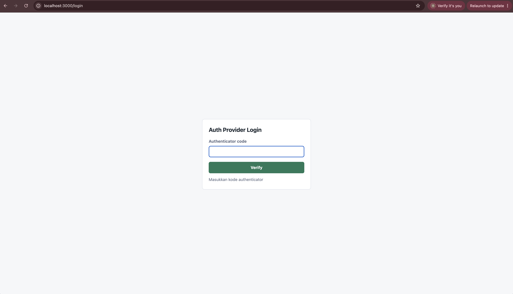

Form kode authenticator setelah password user MFA diterima.

### 5. App A Login

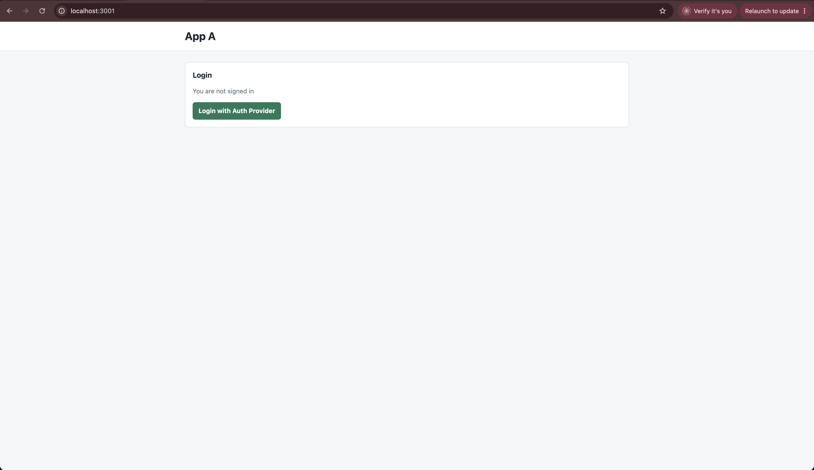

Halaman App A sebelum login.

### 6. App A Logged In

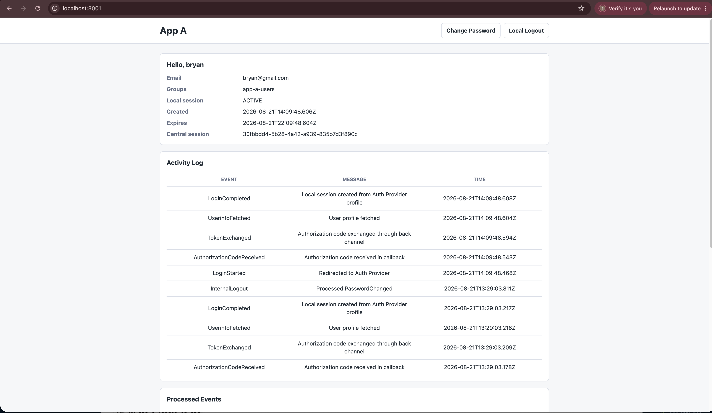

Profil user, local session, dan central session ID App A.

### 7. App A Activity and Events

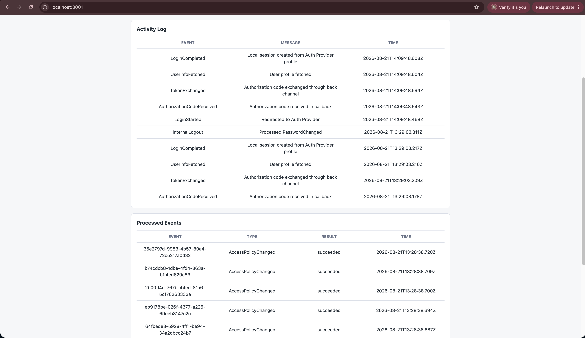

Activity Log dan Processed Events App A.

### 8. App B Logged In

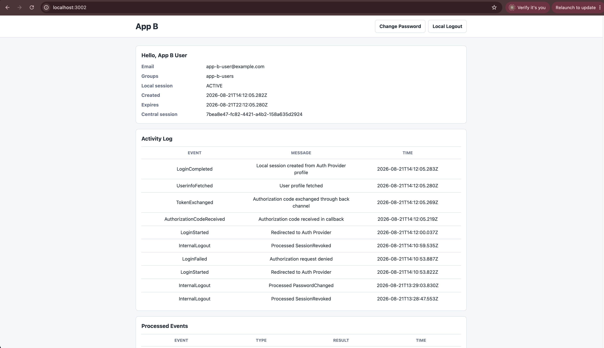

App B logged in menggunakan central session tanpa input password ulang.

### 9. App B Activity and Events

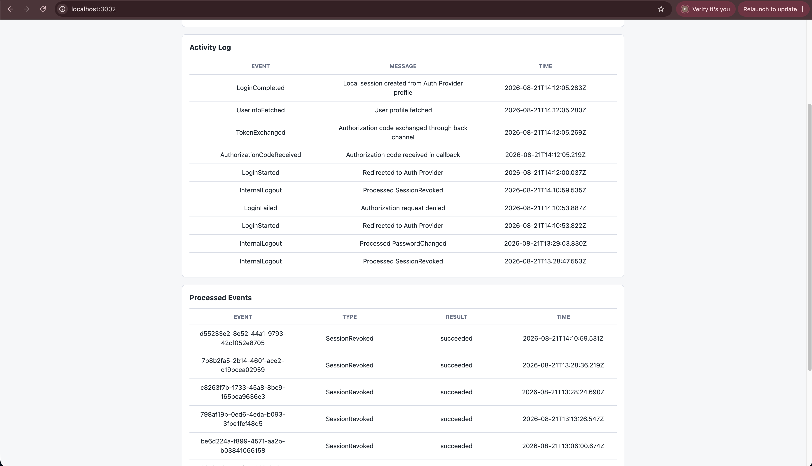

Activity Log dan Processed Events App B.

### 10. Control Panel Users

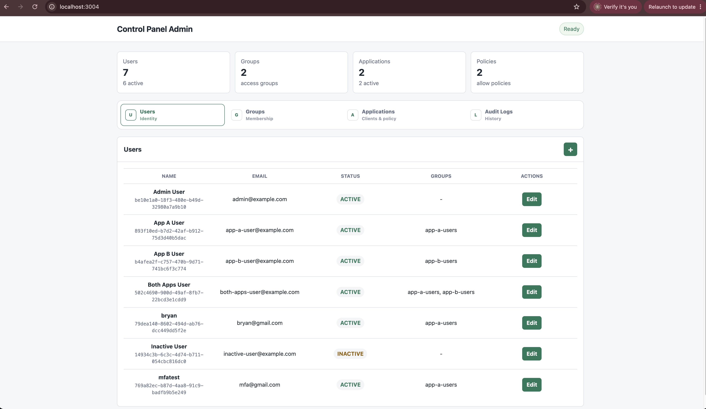

Daftar user dan kontrol pengelolaan user.

### 11. Control Panel Groups

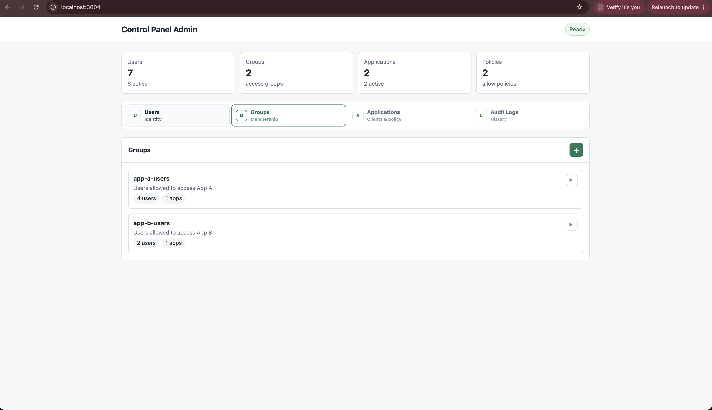

Daftar group, membership, dan policy aplikasi.

### 12. Control Panel Applications

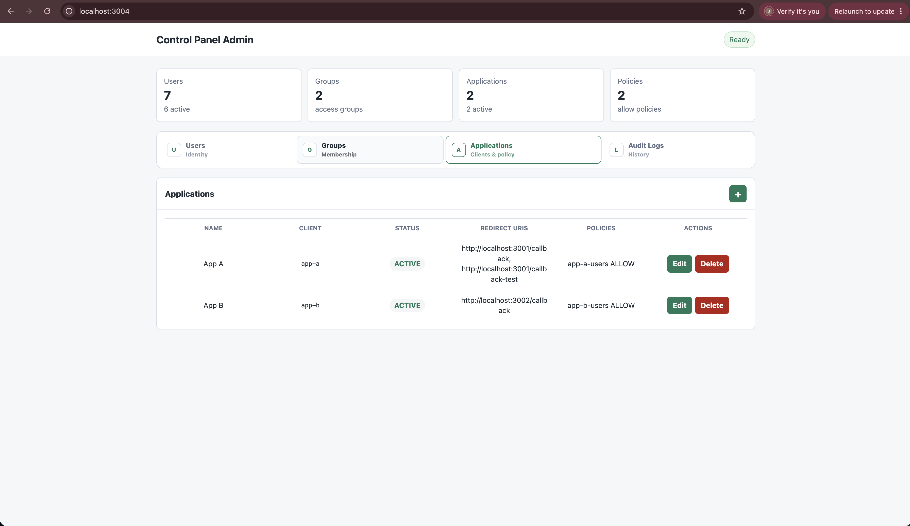

Daftar application, status, redirect URI, dan policy group.

### 13. Control Panel Audit Logs

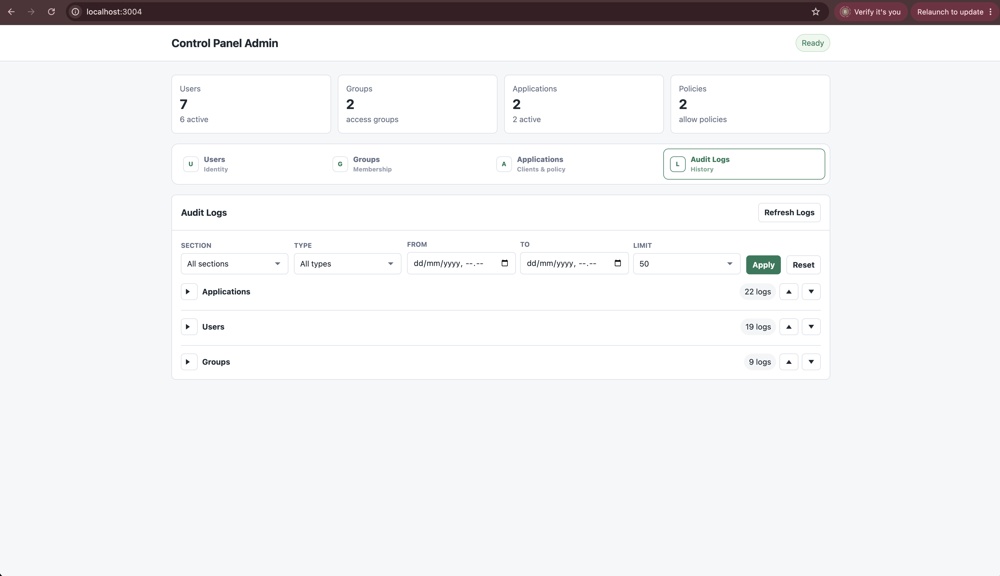

Audit Logs dengan section, event type, dan filter.

### 14. Metrics Dashboard

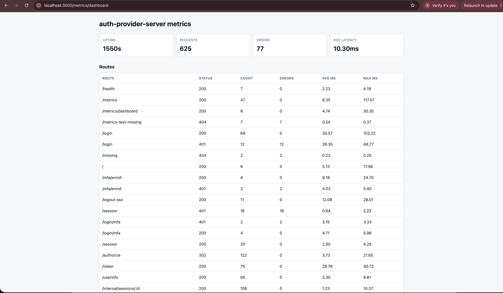

Dashboard requests, errors, latency, dan event delivery backlog.

### 15. RabbitMQ Management

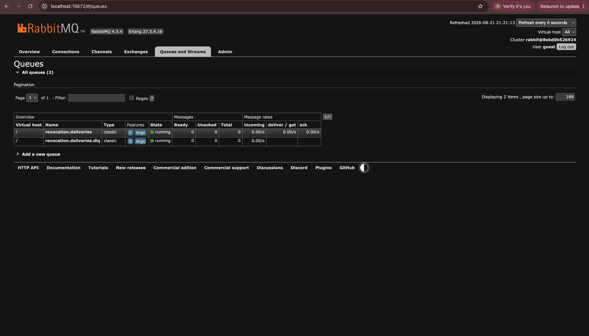

Queue revocation dan Dead-Letter Queue pada RabbitMQ Management.

### 16. Worker Health

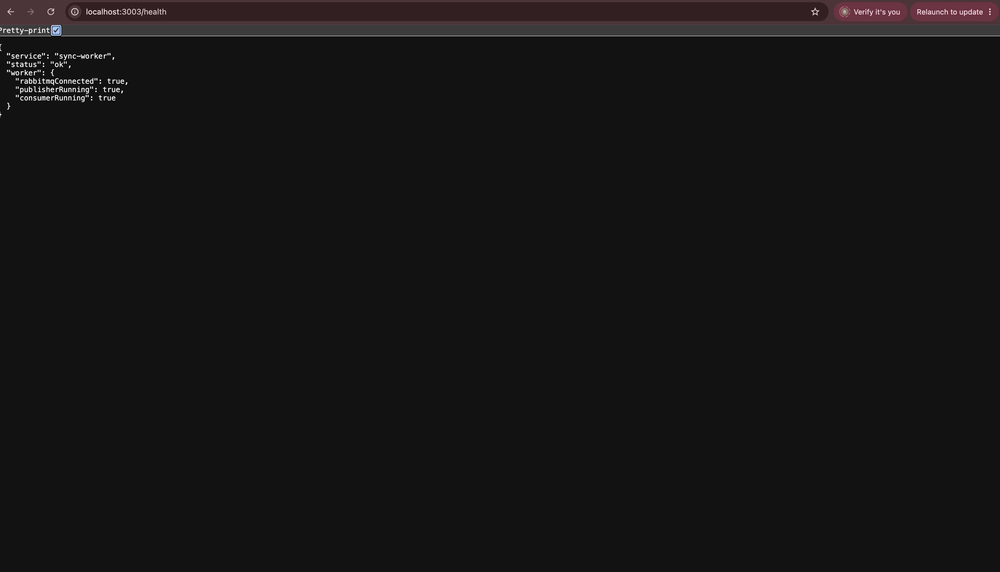

Status health Sync Worker, RabbitMQ connection, publisher, dan consumer.

## Submission Evidence